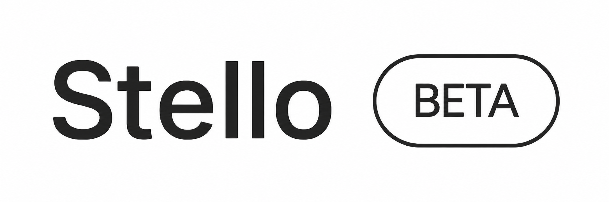
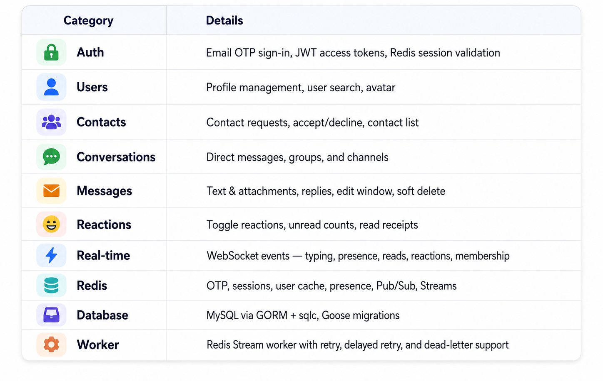
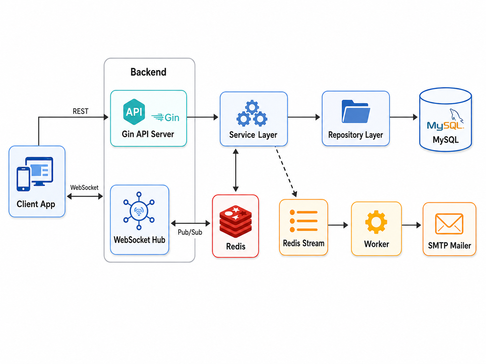
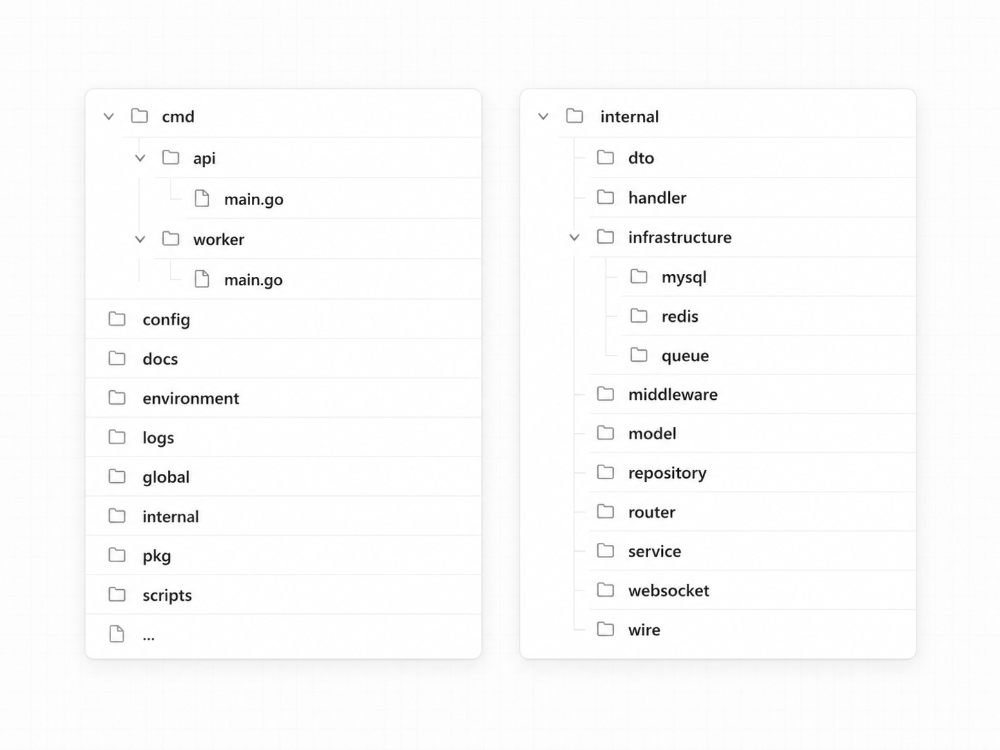

<div align="center">



# Stello — Chat Platform API

A production-grade Go backend for real-time messaging — featuring email OTP auth, JWT sessions, direct/group conversations, WebSocket fan-out via Redis Pub/Sub & Streams, and MySQL persistence.

<br/>

[](https://go.dev/)
[](https://github.com/gin-gonic/gin)
[](https://www.mysql.com/)
[](https://redis.io/)
[](https://github.com/gorilla/websocket)
[](#license)

> **Status:** Core REST API, WebSocket hub, Redis integrations, MySQL repositories, migrations, worker infrastructure, and Docker configuration are included. Unit/contract tests are maintained locally and are not versioned. CI is not yet configured.

</div>

---

## ✨ Features



---

## 🖼 System Overview

<div align="center">
  
</div>

---

## 🛠 Tech Stack

| Layer | Technology |
|---|---|
| **Language** | Go `1.26.2` |
| **HTTP** | [Gin](https://github.com/gin-gonic/gin) |
| **WebSocket** | [Gorilla WebSocket](https://github.com/gorilla/websocket) |
| **Database** | MySQL 8.x, [GORM](https://gorm.io/), [sqlc](https://sqlc.dev/) |
| **Migrations** | [Goose](https://github.com/pressly/goose) |
| **Cache / Realtime** | Redis 7.x — Pub/Sub, Streams |
| **Auth** | JWT HMAC, Redis-backed sessions |
| **Config** | [Viper](https://github.com/spf13/viper), godotenv |
| **Logging** | [Zap](https://github.com/uber-go/zap), Lumberjack |
| **Mail** | SMTP via [go-mail](https://github.com/wneessen/go-mail) |

---

## 📋 Requirements

- Go `1.26.2`+
- MySQL `8.x`
- Redis `7.x`
- SMTP account for OTP emails
- *(Optional)* `make`, `goose`, `sqlc`, `golangci-lint`

```bash
go install github.com/pressly/goose/v3/cmd/goose@v3.24.1
go install github.com/sqlc-dev/sqlc/cmd/sqlc@v1.29.0
```

`make gen` and `make gen_check` run sqlc v1.29.0 through Go directly, so a
standalone sqlc installation is optional. The first run may download the tool.

---

## 🚀 Quick Start

**1. Clone & install**

```bash
git clone https://github.com/dinhdev-nu/chat-platform-api.git
cd chat-platform-api
go mod download
```

**2. Configure environment**

```bash
cp .env.example .env
cp environment/local.example.yaml environment/local.yaml
```

**3. Create the database**

```sql
CREATE DATABASE chat_platform_api
  CHARACTER SET utf8mb4
  COLLATE utf8mb4_unicode_ci;
```

**4. Run migrations and start**

```bash
# Linux / macOS
go run ./cmd/schema
make migrate_up
make run

# Windows (PowerShell)
$env:APP_ENV = "local"
go run ./cmd/schema
$dsn = go run ./cmd/dsn/main.go
goose -dir ./internal/infrastructure/mysql/migrations mysql $dsn up
go run ./cmd/api/main.go
```

On a new database, run the GORM schema command before Goose: chat-table foreign
keys reference `users`. Docker Compose runs these steps in the same order.

**5. Verify**

```bash
curl http://localhost:8080/health
# {"status":"ok"}
```

### Run with Docker Compose

The application image is shared by the API, worker, and migration services.
MySQL and Redis use their official images and do not need separate Dockerfiles.

```bash
# Build the application image and start the full stack
docker compose up --build -d

# Check container and health status
docker compose ps

# Follow API and worker logs
docker compose logs -f api worker

# Verify the API
curl http://localhost:8080/health

# Stop containers while keeping database data
docker compose down

# Stop containers and delete MySQL/Redis data
docker compose down -v
```

Compose reads overrides such as `MYSQL_PASSWORD`, `REDIS_PASSWORD`,
`JWT_SECRET`, `MAIL_FROM`, `MAIL_PASSWORD`, and `API_PORT` from the shell or
the root `.env` file. Replace the development defaults before deployment.

---

## ⚙️ Configuration

The app loads `.env` first, then the YAML file selected by `APP_ENV`:

```
APP_ENV=local       →  environment/local.yaml
APP_ENV=production  →  environment/production.yaml
```

**Required environment variables:**

| Variable | Purpose |
|---|---|
| `APP_ENV` | Runtime environment (default: `local`) |
| `MYSQL_PASSWORD` | MySQL password |
| `REDIS_PASSWORD` | Redis password |
| `JWT_SECRET` | JWT signing secret |
| `MAIL_PASSWORD` | SMTP password / app password |

YAML sections: `server`, `mysql`, `redis`, `logger`, `jwt`, `mail`, `cors`.

---

## 🗃 Database

| Area | Source | Tool |
|---|---|---|
| Users, authentication and contacts | [GORM models](internal/infrastructure/mysql/gorm/model/) | `go run ./cmd/schema` |
| Conversations, messages and related tables | [SQL migrations](internal/infrastructure/mysql/migrations/) | Goose |
| Typed queries | [SQL queries](internal/infrastructure/mysql/query/) and [sqlc.yaml](sqlc.yaml) | sqlc |

```bash
make migrate_up                       # Apply pending migrations
make migrate_status                   # Show migration state
make migrate_down                     # Roll back the last migration
make migrate_create name=add_something # Create a migration
make gen_check                        # Validate SQL queries
make gen                              # Regenerate query code
```

For migration #22, follow the [read-watermark deployment guide](internal/infrastructure/mysql/migrations/README.md).
See [Contributing](CONTRIBUTING.md#database-changes) for schema and generated-code conventions.

---

## 📡 API Reference

**Base URL:** `http://localhost:8080/api/v1`

Protected routes require: `Authorization: Bearer <access_token>`

> IDs are 32-character hex strings encoding `BINARY(16)` values.

### Auth

| Method | Path | Auth | Description |
|---|---|:---:|---|
| `POST` | `/auth/send-otp` | — | Send OTP to email |
| `POST` | `/auth/verify-otp` | — | Verify OTP, issue JWT |
| `POST` | `/auth/logout` | ✓ | Revoke session |

### Users & Contacts

| Method | Path | Auth | Description |
|---|---|:---:|---|
| `GET` | `/users/me` | ✓ | Current user profile |
| `PUT` | `/users/me` | ✓ | Update profile |
| `GET` | `/users/search` | ✓ | Search users |
| `POST` | `/contacts/requests` | ✓ | Send contact request |
| `GET` | `/contacts/requests/incoming` | ✓ | Incoming requests |
| `PUT` | `/contacts/requests/accept` | ✓ | Accept request |
| `GET` | `/contacts` | ✓ | List contacts |

### Conversations & Messages

| Method | Path | Auth | Description |
|---|---|:---:|---|
| `POST` | `/conversations/direct` | ✓ | Get or create DM |
| `POST` | `/conversations/group` | ✓ | Create group / channel |
| `GET` | `/conversations` | ✓ | List conversations |
| `POST` | `/conversations/:id/members` | ✓ | Add member |
| `DELETE` | `/conversations/:id/members/:user_id` | ✓ | Remove member |
| `POST` | `/conversations/:id/messages` | ✓ | Send message |
| `GET` | `/conversations/:id/messages` | ✓ | List messages |
| `POST` | `/conversations/:id/read` | ✓ | Mark as read |
| `PUT` | `/messages/:id` | ✓ | Edit message |
| `DELETE` | `/messages/:id` | ✓ | Soft delete message |
| `POST` | `/messages/:id/reactions` | ✓ | Toggle reaction |
| `GET` | `/ws` | ✓ | WebSocket upgrade |

---

## 🔌 WebSocket

**Endpoint:** `ws://localhost:8080/api/v1/ws?token=<access_token>`

**Client → Server** (inbound frame):

```json
{ "type": "typing", "payload": { "conv_id": "0190d6f2..." } }
```

Supported inbound types: `typing` · `viewing` · `left` · `read`

**Server → Client** (outbound events):

```json
{ "event": "message.new", "conv_id": "...", "msg_id": "...", "sender_id": "...", "seq": 42 }
```

Main outbound events: `typing` · `presence` · `message.new` · `message.read` · `message.edited` · `message.deleted` · `reaction.toggle` · `conversation.created` · `member.added` · `member.removed`

> ⚠️ WebSocket events are **real-time signals, not durable messages.** Clients should resync via REST after reconnecting.

---

## ⚙️ Worker

Redis Stream workers run as a standalone process from `cmd/worker/main.go`. The API process should enqueue jobs and return quickly; it does not start workers inline.

```bash
make run-worker
```

Or directly:

```bash
APP_ENV=local go run ./cmd/worker/main.go
```

| Job type | Stream | Consumer group |
|---|---|---|
| `email.send_otp` | `stream:email` | `email-workers` |
| `conversation.last_activity.update` | `stream:conversation` | `conversation-workers` |
| `conversation.system_message.create` | `stream:conversation` | `conversation-workers` |
| `auth.token_last_used.update` | `stream:auth` | `auth-workers` |
| `user.last_seen.update` | `stream:user` | `user-workers` |

`AuthService.SendOTP` enqueues `email.send_otp`; only the worker process initializes SMTP and sends email.

---

## 🗂 Project Structure

<div align="center">
  
</div>

---

## 🛠 Development

Run these commands from the repository root:

```bash
make help           # List all targets
make run            # Run the API server
make run-worker     # Run the background worker
make build          # Build the API binary
make tidy           # Tidy Go dependencies
make fmt            # Format Go source
make fmt-check      # Check formatting
make lint           # Run golangci-lint
make check          # Check formatting, vet and tests
make test           # Run the local test suite (requires test/)

make seed-plan                        # Preview sample data offline
make seed-apply WRITERS_STOPPED=1       # Write MySQL/Redis; stop API and worker first
make seed-verify-baseline              # Check original totals immediately after seeding
```

On Windows, use Git Bash or WSL for POSIX recipes; seed, format and check targets also support PowerShell.

### Local sample data

Preview sample users, conversations and messages offline for development and testing.
Only an explicit apply writes to the API's configured local MySQL and Redis.
See the [seed guide](cmd/seed/README.md) for profiles, verification, recovery and reset commands.

---

## 🤝 Contributing

See [CONTRIBUTING.md](CONTRIBUTING.md) for development checks, database changes and architecture conventions.

---

## 📝 Open Source Checklist

- [ ] `LICENSE`
- [x] [CONTRIBUTING.md](CONTRIBUTING.md)
- [ ] `SECURITY.md`
- [x] `.env.example`
- [x] Docker / `compose.yaml`
- [ ] CI pipeline (GitHub Actions)

---

<div align="center">

Made with ❤️ by [dinhdev-nu](https://github.com/dinhdev-nu)

</div>
